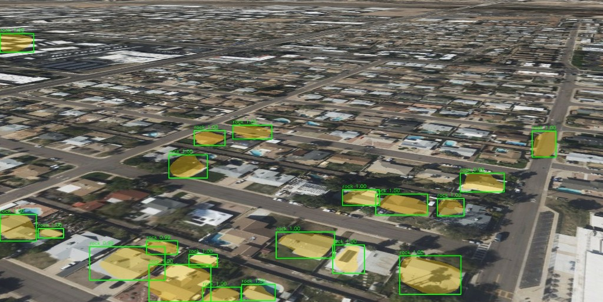
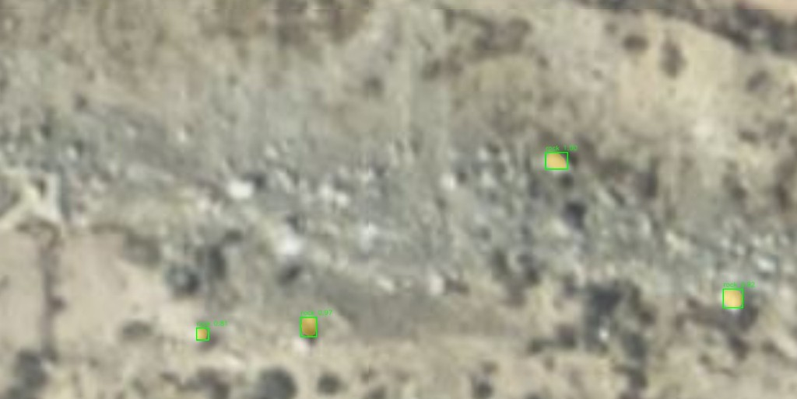

# Distinction Game: Multi-Source Annotation as Kernel Dynamics

> Design document. No implementation in this round. The goal is to show how
> the existing DeepGIS-XR annotation workflow can be re-cast as a
> kernel-dynamics experiment grounded in three preprints, and to specify the
> minimal set of `kernelcal` extensions that would later make it executable.

**Status:** v0.4, Apr 2026. Author: scaffold landed.

**Reference preprints** (PDFs staged at
`dreams-lab-website-server/docs/kernel-dynamics-papers/` on dreamslab):

- **P1** — Das, *Kernel Dynamics under Path Entropy Maximization*,
  arXiv:2603.27880v1, 29 Mar 2026.
  Establishes the kernel `k : X×X → R` as a MaxCal-evolving variable,
  the thermodynamic bound `δW ≥ k_B T · δI_k`, fixed-point conditions
  for self-consistent kernels, and six open questions.
- **P2** — Das, *Spectral Kernel Dynamics via Maximum Caliber: Fixed
  Points, Geodesics, and Phase Transitions*, arXiv:2604.09745v1,
  10 Apr 2026. Decouples the MaxCal stationarity into one-dimensional
  problems with the closed-form solution
  `h*(λ_l) = h_0(λ_l) · exp(−1 − T_l[h*])` (Cor. 1), gives the diagonal
  Hessian stability margin `Δ'` (Cor. 3), the Fisher–Rao log-linear
  geodesic (Cor. 2), the `ℓ²₊` isometry (Prop. 3), and the spectral
  entropy `H[h_t]` as an `O(N)` early-warning of phase transitions
  (Remark 7).
- **P3** — Das, *Spectral Kernel Dynamics for Planetary Surface Graphs:
  Distinction Dynamics and Topological Conservation*, arXiv:2604.20887v1,
  17 Apr 2026. Shows the fixed-point flow is volume-expanding (no
  automatic conservation law), the conservation deficit per mode equals
  `D_m = −Δ'`, introduces the **distinction dynamics** equation
  `dc/dt = G[c, h_t]` with MaxCal-optimal realisation `G_opt`, and
  proves the conditional topology-preserving compression theorem
  *retain ≥ β₀ + β₁ modes*.

The notation in this document tracks the preprints' notation where it does
not collide with DeepGIS-XR conventions.

---

## 0 Executive summary of caveats

This document is a **research design**, not a deployment plan. It is
internally coherent and falsifiable, every quantitative claim traces to
a cited result in P1/P2/P3, and §13 pre-registers metrics. Before any
section is treated as a blueprint, the following caveats apply.

### Load-bearing assumptions that may break

1. **The MI proxy is doing most of the quantitative work.**
   `kernel_mutual_information_change` (log-determinant divergence) is
   used in §4 (mixing constraints), §5 (spectral source term), §6
   (`G_opt` reward), §8 (gate threshold), and §15 (capability ledger).
   Its calibration to *realised work* `δW` is itself an experimental
   metric (§13). If the proxy is loose by ~2× — entirely plausible
   for non-Gaussian region embeddings — every threshold downstream
   collapses from quantitative to **ordinal-only**: still useful for
   ranking queries and taxonomies, no longer usable for "fire the gate
   at this budget."

2. **`δW` units are dimensionally hand-waved.** P1's bound
   `δW ≥ k_B T · δI_k` is rigorous in joules. As soon as `δW` is
   substituted with dollars, GPU-hours, or annotator-minutes, the
   `k_B T` factor becomes an empirical conversion, not a thermodynamic
   constant. The doc has not yet picked one unit and propagated it.

3. **Source independence (§4).** The MaxCal mixer treats `Q_s`
   independently across sources, but SAM and Grounding DINO share the
   SAM backbone (Grounded SAM uses SAM masks); their errors are
   correlated. The independence assumption is silently violated for
   that pair. Fixable in a future version with a joint
   `Q_{SAM, GD}`; not fixed here.

4. **Active-query bootstrapping bias (§6).** `G_opt` predicts
   `δI_k(r)` from the current posterior, which was itself fit on data
   acquired by the same `G_opt` rule. Standard active-learning
   self-confirmation trap. Doc does not currently mitigate it.

5. **Bandit regret is non-stationary (§6).** The reduction to a
   "kernel-disagreement bandit" carries over the algorithmic form but
   *not* the regret guarantee, because the kernels themselves drift on
   each retrain. Treat the §6 efficiency claims as empirical, not
   theoretical.

6. **Topology floor `k ≥ β₀ + β₁` (§7).** Justified by the P3
   figure-eight counterexample, but for genuinely multi-modal urban
   categories the right floor may be larger or context-dependent.
   Treated as a hard rule; easy place to be wrong.

7. **Source names are labels of convenience, not semantic guarantees.**
   A kernel called "MR-rocks" may operationally behave as a stronger
   distinction kernel for *roof-like* blobs than for rocks (PHX
   evidence: confident, coherent firings on house roofs). Any
   apparent X→Y misclassification is part *genuine semantic drift*
   between the training distribution and the deployment scene, and
   part *variance in firing* under unfamiliar context — and the two
   are not always separable from a single tile. The framework
   treats every source's *firing pattern* as the durable object and
   its *label* as a fitted `Q_s` (§4); reading a source's name as
   its semantics silently asserts what the MaxCal mixer is meant
   to discover, and over-estimates retraining cost in any scene
   where the kernel is already aligned with the desired distinction
   — `Q_s` refits (§4) can absorb the relabel without moving any
   weights, which is the **R1 rung** of the three-rung retraining
   ladder of §8.1.

   

   *Figure 0.7a — MR-rocks deployed on PHX residential blocks. The
   model named for "rock" segmentation fires confidently
   (`score ≈ 1.00`) and coherently on house roofs. The detections
   are not random noise: they concentrate on a morphologically
   consistent class (compact, bright-against-context, geometric
   blobs) that happens to be roofs in this scene and was rocks in
   the training set. Same kernel, different label semantics.*

   

   *Figure 0.7b — Same MR-rocks model on a genuine rocky-terrain
   tile. Firings are sparse, small-scale, and lower-confidence than
   in Figure 0.7a. The kernel is therefore **bimodal**: a strong
   distinction kernel for roof-like compact blobs (Fig. 0.7a) and
   a weak rocks kernel (Fig. 0.7b). Firing strength itself
   discriminates the regimes — the basis for a firing-strength-
   conditioned `Q_MR(c | r, ‖k_MR(r)‖)` instead of a single
   confusion matrix.*

### Free parameters with no principled setter

- **`λ_retain` (§15).** The price of one nat of forgetting in units
  of one nat of new capability. Ablated `∈ {0, 0.5, 1, 2}` but no
  procedure for picking one. Per-deployment operator judgment is
  honest; weak as a deployment story.
- **`T_eff` (§8, §15).** The "effective temperature" converting
  `δI_k` to `δW`. Currently a free scalar fit by calibration runs.
- **Probe-set curation (§15.5).** Discipline (frozen, versioned,
  disjoint, bootstrap CIs) is specified; *how to choose probe
  examples* is not. A probe biased toward easy rocks misjudges
  forgetting on hard rocks. Sub-doc deferred.

### Instrumentation cost likely to slip

- **NTK-trajectory geodesic measurement (§15.3, §11.7
  `fisher_rao_geodesic_deviation`).** Requires logging NTK Gram
  probes per epoch on a Mask R-CNN backbone. Single most expensive
  instrumentation item in the doc; budget at minimum one engineer-
  week separately. Will quietly get cut otherwise.

### Sample-size and statistics

- **Phase C is borderline-powered.** 3 players × 200 tiles × 2
  policies at α=0.05 assumes inter-seed sd ≈ 0.03. Real human-
  annotator variance is typically 1.5–2× synthetic estimates;
  re-estimate sd from a 30-tile pilot before committing.
- **§13 forgetting-prediction bar (Spearman ρ ≥ 0.6 over 10
  events) is weak.** ρ = 0.6 is barely useful and N = 10 is small.
  Tighten to ρ ≥ 0.5 over 30+ events for a meaningful claim.

### Things the doc does *not* address

- **Human-subjects practicalities.** Phase C with human players
  has IRB-adjacent considerations (consent, compensation, data
  retention, opt-out). Not specified.
- **Pre-registration artifacts.** §13 asserts pre-registered
  metrics but no OSF entry, internal git tag, or storage location
  is named.
- **Framework-misfit detection.** §13 lists failure modes within
  the framework. Missing: a detector for tiles where the
  framework itself does not fit (homogeneous regions for which
  `H[h_t]` never drops; genuinely complex scenes where `β₁` of
  `M` keeps growing). Without it, we will misattribute framework
  failure to algorithmic failure.

### Scope honesty

- **As a research-design artifact** (workshop paper, registered
  report, internal experiment plan): **strong**. Coherence,
  falsifiability, and explicit non-claims are all present.
- **As a build plan for a deployable system**: **incomplete**.
  Items (1)–(6) above and the free parameters need to land
  before "should DeepGIS-XR rely on this in production" is
  answerable.
- **OQ1 and OQ2 (P1)** become testable on first real retrain
  via §15.3. **OQ4 and OQ5** are testable directly on Phase C.
  **OQ3 and OQ6** remain conjectural bridges.

A reader who needs only the bottom line: §15's symmetric bound and
per-target gate are the most novel contributions; they are also the
most exposed to caveat (1). The MI-proxy calibration in §13 is the
single experiment whose result determines whether everything else is
quantitative or merely ordinal.

---

## 1 Problem statement

DeepGIS-XR currently has, for the urban-Phoenix (PHX) workflow, a single
binary perception kernel — Mask R-CNN trained on a single class **rock** —
plus several other capabilities that are not yet jointly fused:

| source                | kind                                    | bias                                 | variance | latency           | retraining cost |
|-----------------------|-----------------------------------------|--------------------------------------|----------|-------------------|-----------------|
| **SAM**               | class-agnostic instance segmentation    | over-segments shadows, glass         | low      | seconds (GPU)     | none (frozen)   |
| **Grounding DINO**    | open-vocabulary box+mask from a phrase  | obeys phrase wording, misses long-tail | medium | ~1 s/phrase (GPU) | none (frozen)   |
| **Mask R-CNN-rocks**  | single-class mask head                  | confuses building roofs with rocks   | medium   | ~150 ms (GPU)     | minutes–hours   |
| **OSM**               | polygon tags (`building`, `highway`, …) | tag-coverage gaps, vintage           | low (where present) | bbox query | none            |
| **Human expert**      | high-precision mask + free-form label   | personal taxonomy, fatigue           | high     | minutes           | per-tile cost   |

The **goal** is to learn a multi-category Mask R-CNN whose taxonomy emerges
from data, with cost-aware retraining triggers, while at inference time
emitting a **probabilistic** prediction over `(region, category)` that fuses
all available kernels — including SAM regions whose category is unknown,
which feed back as a continuous-learning channel.

The **constraint** is minimal-cost retraining: every human click should buy
maximal information about the kernel, every retraining trigger should be
gated against the actual energetic cost of moving the kernel, and the
emerging vocabulary should be the smallest one that preserves the
topological structure of the labelled scene.

The framework must generalise. PHX with OSM is the testbed; replacing OSM
with USGS NHD streams or GBIF species ranges, and the rock head with a
drainage- or vegetation-segmentation head, must be a configuration change
not a code change.

---

## 2 Notation and prior results we lean on

Let `T = {tiles}` be the set of Cesium captures of interest.
For each tile `t ∈ T`, let `R_t = {regions}` be the set of candidate
regions on that tile (SAM segments, MaskRCNN detections, OSM polygons,
Grounding-DINO proposals, all dropped into a single set after
deduplication-by-IoU). Let `C_t ⊆ C_active ⊆ V` be the active category
vocabulary, where `V` is the universe of category strings ever seen.

A **label source** `s ∈ S = {SAM, GD, MR, OSM, H}` provides for each
region `r` a (possibly absent) prediction `ŷ_s(r)` and an empirical
confusion matrix `Q_s(ŷ | y)` that is calibrated against OSM-anchored
regions where ground truth is free.

A **kernel** is a positive-semidefinite matrix `k_s ∈ R^{|R_t| × |R_t|}`
whose `(r, r')` entry encodes the similarity between two regions under
source `s`. Symmetrisation and PSD projection follow
`kernelcal.kernel.space.project_to_psd`.

We adopt the following from the preprints:

**(P1) Thermodynamic bound on kernel work.** For any update of the
kernel from `k_1` to `k_2`,

```
δW  ≥  k_B T · δI_k(k_1 → k_2)
```

where `δI_k` is the mutual information newly unlocked by the kernel
update. We use this as the gate for retraining decisions. A concrete
*proxy* estimator already lives at
`kernelcal.thermodynamics.bounds.kernel_mutual_information_change`
(spectral log-determinant divergence between the two kernel Gram
matrices, conservatively lower-bounding the true MI), and the bound
check at `kernelcal.thermodynamics.bounds.check_landauer_bound`.
Because the estimator is a proxy, **its calibration against realised
work is itself an experimental metric** (§13, gate calibration);
none of the §8 gate behaviour assumes the proxy is exact.

**(P2 Cor. 1) Closed-form spectral fixed point.** On a finite graph
with normalised Laplacian eigenpairs `(λ_l, φ_l)` and reference
spectral kernel `h_0`, the MaxCal-optimal spectral transfer satisfies

```
h*(λ_l)  =  h_0(λ_l) · exp( −1 − T_l[h*] )
```

`T_l[h]` is the source term that depends on the perception sources we
fuse on this tile.
`kernelcal.terrain.diagnostics.fixed_point_kernel` already implements
this iteration with the Gaussian-MI source from P1 Eq. 15; we will
substitute a label-disagreement source term in §5.

**(P2 Remark 7) Spectral entropy as phase-transition early warning.**

```
H[h_t]  =  −Σ_l ĥ_t(λ_l) · log ĥ_t(λ_l)
```

is `O(N)` to compute and drops sharply ahead of structural phase
transitions in the underlying graph dynamics. We treat such a drop on
the per-tile region graph as the empirical signature that a *new sharp
distinction* — i.e. a candidate new category — is becoming useful.

**(P3) Distinction dynamics.** The scene-side categories evolve under

```
dc/dt  =  G[c, h_t]
```

with MaxCal-optimal realisation `G_opt`. We use `G_opt` as the active
query rule: pick the region whose label maximally lowers conditional
entropy of `c` given `h_t`. The conservation deficit per mode equals
the negative Hessian stability margin `D_m = −Δ'`, which gives a
bookkeeping for *how much information the scene has to absorb to
reflect a kernel change*.

**(P3 Topology-preserving compression theorem.** Under the spectral
ordering assumption, retaining `k ≥ β₀ + β₁` modes preserves all
Betti-number charges. A worked counterexample (figure-eight short
cycle) characterises the failure case. We re-purpose this on a
*category meta-graph* (§7) to set a minimum-vocabulary floor.

---

## 3 Distinction kernels

For each tile `t` we instantiate one kernel per source, all on the same
ground set `R_t`. The pattern is uniform: convert source-specific
similarity into a real-valued symmetric matrix and PSD-project.

### 3.0 Framing: each source is a distinction operator, not a label oracle

Each `k_s` is a **distinction kernel** in the P1 sense: a positive-
semidefinite similarity matrix whose firing pattern encodes which
regions the source treats as similar, *independent of what we name
that similarity*. Per-source label semantics are encoded separately
in `Q_s(ŷ | c)` (§4) and **fitted**, not asserted. Two consequences
follow.

First, source names — `k_MR` ("rocks"), `k_OSM` ("buildings"),
`k_GD` (a phrase) — are *labels of convenience*. The framework is
agnostic to whether the kernel a source produces actually fires on
the class its name advertises. This is exactly the question the
MaxCal mixer of §4 is set up to answer empirically (§0 caveat #7;
Figs. 0.7a, 0.7b).

Second, kernel motion and label-map motion are **separable
operations**. P1's bound `δW ≥ k_B T · δI_k` is rigorous when
applied to either alone, and each is genuinely cheap when the other
is held fixed:

- *Refitting `Q_s`* with the kernel held fixed costs the work of
  fitting a small label map (~bytes; no GPU); P1's bound applies on
  the label-side mutual information only.
- *Retraining the network* moves both kernel and labels, paying the
  full §15 capability-transfer ledger.

The §8 retraining gate therefore generalises naturally to a
**three-rung ladder** (§8.1) over (relabel only / head fine-tune /
full retrain), with rung selection decided by spectral alignment
between the existing kernel and the desired distinction. The rest
of §3 specifies each `k_s` concretely; §4 specifies how `Q_s` is
fitted from data given those kernels.

### 3.1 SAM similarity kernel `k_SAM`

Class-agnostic. For SAM segments `r, r'`,

```
k_SAM(r, r')  =  exp( − γ_SAM · (1 − IoU(mask_r, mask_r')) )
                ·  exp( − ‖embed(r) − embed(r')‖² / 2σ_SAM² )
```

where `embed(·)` is the SAM-image-encoder feature pooled within each
mask. SAM contributes to the **regions** of the ground set, not to
category logits — there is no `Q_SAM` in the confusion-matrix sense.

### 3.2 OSM membership kernel `k_OSM`

For OSM features `f` with tag `tag(f) ∈ {building, highway, natural=tree,
…}`,

```
k_OSM(r, r')  =  Σ_f  α(tag(f)) · 1[r ⊂ f] · 1[r' ⊂ f]
```

This is a rank-`|F|` PSD matrix with `α(tag)` an explicit tag-trust
weight (1.0 for building footprints, lower for tags whose vintage in
PHX is poor). On OSM-anchored regions the implied label is treated as
*conditionally noiseless on the tag itself*; ontology coverage is the
dominant source of error and is accounted for by leaving categories
outside the OSM tag set free in the posterior.

### 3.3 Grounding DINO kernel `k_GD`

For each phrase `p` in a default phrase set
`P = {"building", "rock", "tree", "road", "vehicle", …}`, GD emits a set
of (box, mask, score) triples. Define

```
k_GD^p(r, r')  =  GD-score(r | p) · GD-score(r' | p)
                  ·  exp( − γ_GD · (1 − IoU(box_r, box_r')) )
k_GD          =  Σ_p w(p) · k_GD^p
```

The phrase weights `w(p)` are themselves tuned by the MaxCal mixer: a
phrase with persistently low information gain is down-weighted.

### 3.4 Mask R-CNN region kernel `k_MR`

The current single-class rocks head emits `(box, mask, score)` per
detection. Define

```
k_MR(r, r')  =  σ(score_r) · σ(score_r') · exp( − γ_MR · (1 − IoU_r,r') )
```

with `σ` the sigmoid of the head's logit. The per-source confusion
matrix `Q_MR` is the matrix that, on OSM-supervised tiles, captures
how often the MR head calls a building-roof region `rock` (the
"roofs as rocks" pathology; see **Figs. 0.7a, 0.7b** for the
visual evidence and the *bimodal-distinction-kernel* reading the
mixer should adopt). Because we may *replace* this head with a
multi-category head — *or* simply refit `Q_MR` if the kernel is
already aligned with the desired distinction (§0 caveat #7) —
`Q_MR` is also the prior over what either path must improve on.

### 3.5 Human-annotator kernel `k_H`

Per annotator `a`, we maintain `Q_{H,a}(ŷ | y)` from past tile
annotations. The kernel

```
k_H(r, r')  =  1[a labelled both r and r'] · agreement(a, r, r')
```

is rank-bounded by the count of regions a single annotator has touched.
For multiple annotators we average across `a` weighted by their measured
calibration.

### 3.6 The mixed kernel

After PSD projection, the per-tile mixed kernel that drives all
downstream computation is

```
k_mix  =  Σ_s λ_s · k_s,    with λ_s ≥ 0,  Σ_s λ_s = 1
```

The `λ_s` are not free hyperparameters: they are fitted by MaxCal in §4.

---

## 4 MaxCal kernel mixing

For a region `r` with per-source predictions
`(ŷ_SAM(r), ŷ_GD(r), ŷ_MR(r), ŷ_OSM(r), ŷ_H(r))`, the path-entropy-
maximising posterior over its category `c` factors as

```
log p(c | r)  =  const
              +  Σ_s λ_s · log Q_s( ŷ_s(r) | c )      (per-source likelihood)
              +  λ_topo · log P_topo( c | N(r) )      (neighbourhood prior)
```

where `N(r)` are the graph-neighbours of `r` under the SAM-superpixel
adjacency and `P_topo` is the harmonic extension of currently-known
labels along that adjacency.

`λ = (λ_s for s ∈ S, λ_topo)` is fitted by

```
λ̂  =  fit_lagrange_multipliers( log_q, F, F̄ )
```

(`kernelcal.maxcal.functional.fit_lagrange_multipliers`) where:

- `log_q` is the uniform reference over (`region`, `category`) pairs.
- `F` is the feature matrix, one column per constraint.
- `F̄` is the target value of each constraint.

We impose three families of constraints:

1. **OSM-anchor agreement.** On the subset `R_t^{OSM}` of regions whose
   OSM tag is unambiguous,
   `〈 1[ argmax_c p(c|r) = OSM-tag(r) ] 〉 ≥ μ_OSM`
   (target reliability against the free supervision channel).
2. **Bounded inter-source disagreement.**
   `〈 hs_distance(k_s, k_mix; X_ref) 〉 ≤ δ`
   for each `s`, using `kernelcal.bandits.kernels.hs_distance` against
   a small reference set `X_ref` resampled per fit. Prevents the mixer
   from collapsing onto a single source.
3. **Coverage matching.** For each source `s` and each tag-superclass
   `g` (e.g. `g = "building"`), the average source response on that
   superclass matches its measured rate: `〈 ŷ_s(r) ≈ g 〉 = c_{s,g}`.

The fit yields both the weights `λ̂` and a posterior callable `p(c | r)`
suitable for downstream entropy computations.

The **"MaskRCNN calls roofs rocks"** pathology is fixed structurally:
if `Q_OSM(ŷ_OSM = building | c = building)` is near 1 and
`Q_MR(ŷ_MR = rock | c = building)` is materially > 0 from the
calibration set, the MaxCal fit drives `λ_OSM` up and `λ_MR` down
*on regions where OSM speaks*, while leaving `λ_MR` untouched
elsewhere — exactly the conditional reliability behaviour we want.

---

## 5 Spectral kernel dynamics on the per-tile region graph

For each tile `t` build the region graph `G_t` whose node set is `R_t`
and whose edges are SAM-adjacency plus IoU-overlap above a threshold,
weighted by IoU. Compute the normalised Laplacian `L_t` and its
eigendecomposition `(λ_l, φ_l)`.

We run the closed-form P2 iteration

```
h_{n+1}(λ_l)  =  h_0(λ_l) · exp( −1 − T_l[h_n] )
```

with a **label-disagreement source term**:

```
T_l[h]  =  Σ_s λ_s · ⟨ φ_l, D_s · φ_l ⟩  /  ( σ_s² + h(λ_l) )
```

where `D_s` is the per-region diagonal matrix of *local label
disagreement* between source `s` and the current mixture
(empirically: cross-entropy between `Q_s(ŷ_s | c)` and `p(c|r)`).
`σ_s² > 0` is the noise floor of source `s` taken from its
calibration; for `s = OSM` on an unambiguous tag, `σ_s²` is small.
The fixed-point routine
`kernelcal.terrain.diagnostics.fixed_point_kernel` already handles
the iteration; the substitution above is the source-term swap.

From the converged `h*` we read off three diagnostics, all `O(N)`:

- **Spectral entropy** `H[h*] = −Σ_l ĥ*(λ_l) log ĥ*(λ_l)` (P2 Remark 7,
  via `kernelcal.terrain.diagnostics.spectral_entropy_from_laplacian`).
  We track `H[h_t]` over the per-tile annotation episode; a sharp drop
  means a new sharp distinction is emerging — that is the moment to
  consider forking a new category in `C_active`.
- **Fiedler concentration** `‖φ_2‖_∞ / ‖φ_2‖_2`, exactly
  `kernelcal.terrain.diagnostics.fiedler_mode_gap` (P2 Cor. 3 +
  P3 triple diagnostic). High concentration on a small set of
  regions is the spatial fingerprint of an emergent category.
- **Curl energy** of the source-disagreement edge field, via
  `kernelcal.terrain.channels.hodge_edge_decompose`. Under P3 this
  is the dual signal — when curl rises, we have circular disagreement
  among sources that cannot be resolved by adding one more category;
  it indicates the wrong taxonomy.

The **triple necessary diagnostic** of P3 (Fiedler concentration,
curl rise, β₁ anomaly) translates from drainage networks to region
graphs unchanged because both are 1-skeletons of 2-complexes.

---

## 6 Distinction dynamics: the annotation game

The scene-side categories `c(t)` evolve under
`dc/dt = G[c, h_t]` (P3). We pick the MaxCal-optimal realisation
`G_opt` as the active query rule:

> **G_opt rule.** Show the player the region `r*` that maximises
>
> ```
> ΔU(r)  =  E[ δI_k(r) | answer ]   /   cost(query, source)
> ```
>
> over candidate regions and over the *cheapest mode of asking*
> (agree/disagree click vs. category pick vs. polygon edit).

Concrete estimators:

- `E[δI_k(r) | answer]` is computed as the expected change in
  `kernel_mutual_information_change(K_before, K_after_for_each_answer)`
  marginalised over the current posterior `p(c|r)`. We approximate
  the expectation over the top-`m` posterior modes of `c`.
- `cost(query, source)` is a number of seconds × a per-source
  cost-rate (human-second is the most expensive; agree/disagree
  click cheaper than free-text label).

This reduces to a **kernel-disagreement bandit** with arms = candidate
regions and rewards = realised `δI_k`. We reuse
`kernelcal.bandits.agents.MixtureKernelAgent` with the per-region
kernel set `{k_s(r, ·)}_s` and a Hilbert-Schmidt-disagreement reward.
Existing consensus utilities — `kernelcal.bandits.kernels.hs_distance`,
`kernelcal.bandits.kernels.kernel_consensus` — implement the
between-source averaging that the bandit's exploration term needs.

### 6.1 Game flow (description only, no UI)

1. Player loads a Cesium tile in the Label Rocks tab (already exists).
2. The backend overlays:
   - SAM segments (uncolored, rendered with low alpha).
   - Mask R-CNN-rocks predictions, coloured by the current head.
   - Grounding DINO proposals from the default phrase set, coloured by phrase.
   - OSM footprints (translucent fill, tag-coloured outline).
3. The backend ranks regions by `ΔU(r)` and highlights the top-K
   (`K = 3` initially). The player can also pan to any region.
4. The player issues one of four answer-types, in order of cheapness:
   - **agree** with the current posterior's argmax,
   - **disagree** without specifying a category,
   - **pick** from the top-3 categories under the posterior,
   - **type** a free-form category — which becomes a new candidate
     in `V` and a new column in the posterior.
5. Each answer:
   a. updates the per-source confusion `Q_s`,
   b. triggers a re-fit of `λ̂` via MaxCal,
   c. recomputes `h*` and `H[h*]` for the tile,
   d. pushes the updated `δI_k` accumulator and increments the bandit's
      observed reward for its arm.
6. The on-screen **distinction meter** displays `H[h*]` (spectral
   entropy) and the running `Σ δI_k`, so the player sees the
   information impact of their own clicks. This is also the data that
   feeds the retraining gate (§8).

The game **never** asks the player for a region whose category is
already pinned to OSM — those count as supervision but produce zero
`δI_k`, hence are not surfaced.

---

## 7 Topology-preserving category vocabulary

The active vocabulary `C_active ⊆ V` should be neither too small (loses
distinctions) nor too large (overfits, fragments labels). P3 gives the
bound we use.

Define the **category meta-graph** `M` whose nodes are categories in
`C_active` and whose edges connect two categories that ever co-occur as
the *top-2 modes* of the posterior on the same region — i.e., they are
operationally confusable. Edge weights are the empirical co-occurrence
count.

Let `(β₀, β₁)` be the Betti numbers of `M`. Then by P3's compression
theorem, the smallest topology-preserving sub-vocabulary has size
`≥ β₀ + β₁`. We implement this as a hard **floor** on `|C_active|`.

The figure-eight short-cycle counterexample of P3 §6 transfers
literally: a "short cycle" in the category meta-graph (e.g.,
`flat_rock_field ↔ building_roof ↔ shadow ↔ flat_rock_field` on
just three confusing tiles) means the spectral-ordering assumption
fails locally and the floor must be taken with care. We surface this
as a *vocabulary warning* — the doc will note that the operator
should review category definitions before pruning when a short cycle
is detected.

Pruning policy:

- **Merge** two categories `c_a, c_b` only if (i) the meta-graph
  edge between them is heavy-weighted **and** (ii) removing it does
  not drop `β₀ + β₁`.
- **Promote** a free-form typed label to a permanent category only
  when its meta-graph component has Betti numbers consistent with a
  new island (`β₀` increases by 1, `β₁` unchanged).

---

## 8 Thermodynamic retraining trigger

The current sentinel logic is "after `N` new tiles, fire `RETRAIN_READY`".
We replace the count-based trigger with the **MaxCal/Landauer bound**
of P1.

Define:

- `δW(retrain)` — the empirical cost of one retraining pass:
  GPU-hours × $/hour for the maskrcnn-rocks docker host, plus
  expected human-review time for the resulting model. Numbers come
  from the dataset config; both are configurable knobs.
- `T_eff` — an effective temperature exposed in the dataset config.
  At `T_eff = T_room` the bound is interpreted physically; at
  `T_eff > T_room` we are demanding more `δI_k` per unit of work
  before retraining (more cautious), at `T_eff < T_room` less
  (more eager).
- `Σ δI_k(batch)` — the accumulated kernel mutual information unlocked
  by all answers since the last retrain, computed via the proxy
  `kernel_mutual_information_change(K_before, K_after)` (see §2 caveat)
  on the per-tile mixed kernels at the boundaries of the batch. The
  proxy is conservative (lower-bounds true MI), so a fired gate is
  *at least* as well-supported by the bound as the proxy reports;
  the converse — a held gate that should have fired — is the
  failure mode the §13 calibration check guards against.

The retraining gate fires when **both**:

```
Σ δI_k(batch)              ≥   δW(retrain) / (k_B · T_eff)
|C_active|                  ≥   β₀ + β₁          (P3 floor)
```

This replaces the count-based `min_tiles_for_training` field on
`TrainingDataset` with a derived quantity. The existing sentinel
file mechanism on the GPU host stays as the implementation detail
that makes the trigger observable to the training service.

The gate is **cost-aware, not count-aware**: a batch of 20 tiles in
which a player resolved high-disagreement regions can fire the gate
when 200 tiles of agreement-with-OSM regions would not.

### 8.1 Three-rung retraining ladder

§8 fires *that* a retraining is warranted; it does not say *which
operation* counts as a retraining. Per the §3.0 framing, kernel
motion and label-map motion are separable and have categorically
different costs. The gate therefore selects from three rungs.

**(R1) Relabel only — refit `Q_s` with the kernel held fixed.**
No weights move. Cost: fitting a small label map from
~`O(10²)` supervised pairs (OSM-confirmed rooftops, e.g.). Compute
budget: bytes of disk I/O, no GPU. Forgetting risk on prior
capabilities: **zero**, because P1's `δW ≥ k_B T · δI_k^retain` on
a frozen kernel reduces to bookkeeping over `Q_s` only and
`δI_k^retain` from §15 is identically zero on the kernel side.
*When it works:* the existing kernel `k_s` is already well-aligned
with the desired distinction (operationalised below).

**(R2) Head fine-tune — last-layer weights move; backbone frozen.**
Cost: minutes on one GPU; partial forgetting bounded by §15 but
restricted to the head's read-out modes (the backbone's NTK is
unchanged, so `δI_k^retain` on backbone-defined probes is small).
*When it works:* the backbone's kernel is right but the read-out is
wrong — typically when alignment is moderate but a clean linear
projection from backbone features to the new class is recoverable.

**(R3) Full retrain — backbone + head.**
Cost: hours on one GPU; full §15 capability-transfer ledger
applies; `δI_k^retain` on the prior probe must be predicted
(§15.2) and accepted before firing. *When it works:* the kernel
itself must move because no relabelling or head-tune captures the
desired distinction.

#### Selection by spectrum alignment

Define, for an existing source kernel `k_s` and a candidate target
class `c*` on a held-out probe set `P`,

```
align( k_s, c* ; P )  :=  max_{m ≤ k}  cos( eigvec_m(K_s|_P), 1_{c*}|_P )
```

i.e. the highest cosine similarity between the top-`k` eigenvectors
of `K_s` evaluated on `P` and the indicator vector `1_{c*}` on `P`.
Computed via `kernelcal.thermodynamics.capability_probe` (see §11.7).

Rung selection rule:

| `align( k_s, c* )` | rung | rationale                                            |
|--------------------|------|------------------------------------------------------|
| `≥ 0.7`            | R1   | kernel already encodes `c*`; only the label is wrong |
| `[0.4, 0.7)`       | R2   | backbone close; head needs to learn the projection   |
| `< 0.4`            | R3   | kernel genuinely off; weights must move              |

Thresholds are pre-registered (§13) and ablated `± 0.1` to confirm
the choice is not knife-edge. The PHX worked example (Figs. 0.7a,
0.7b) is expected to land at `align(k_MR, house) ≈ 0.85` —
firmly R1 — and `align(k_MR, rock) ≈ 0.45` — borderline R2 —
*on the same kernel*, which is the bimodal-distinction-kernel
reading made operational.

#### Honest caveats

- **Tangled kernels.** When `k_s` fires equally strongly on
  multiple desired classes with no separating spectral structure
  (low gap between modes that correlate with `c*` and modes that
  do not), no `Q_s` can untangle them; R1 silently fails, the
  alignment score remains in the R2/R3 band. The §11.7 module
  reports the spectral gap alongside `align`, and a small gap
  forces an automatic escalation to R3.
- **Probe-set dependence.** `align` is computed on a *probe* set
  (§15.5 discipline). On a non-representative probe, R1 may
  succeed on the probe but degrade on deployment. The §13
  relabel-success metric measures realised R1 success in the
  field as a check.
- **The ladder is not a free lunch.** R1 saves `δW` only when
  alignment is genuinely high; the cost of *checking* alignment
  is itself a small but non-zero `δW` term — one probe-set
  evaluation per rung-decision. Amortised across many candidate
  targets, this is dominated by the cost of even one R3 we
  avoided; on a single-target deployment, it is the dominant
  cost on R1 paths.

---

## 9 Continuous learning via SAM unknowns

SAM produces many segments whose category remains unknown. Treat them
as `c = ?` rows in the posterior. Two channels feed back into the
pipeline without human intervention:

**Auto-promotion.** A SAM segment auto-promotes to a labelled training
example for the multi-category Mask R-CNN when, across `K = 3`
independent passes (different phrase prompts to GD; different image
patches around the segment; different time-of-day captures if
available), its posterior concentrates above threshold `τ` on the same
known category. The training-example confidence weight equals the
posterior mass.

**Open-set queue.** A SAM segment whose posterior fails to concentrate
across `K` passes is enqueued for human review with priority
proportional to its `H[h*]` contribution. This is exactly the kind of
region where the spectral-entropy drop in P2 Remark 7 will fire next,
so feeding the open-set queue back into the active query rule is
self-consistent.

The two channels together implement the *"DeepGIS is always trying to
learn"* commitment: every tile contributes either a labelled training
sample (auto-promotion), a high-information query (open-set queue),
or a confusion-matrix update (every region with any source prediction).

---

## 10 Generalisation beyond PHX

The pipeline assumes only the following abstract interfaces:

1. **Bbox-queryable ground-truth source** with a tag/attribute
   schema. Implementations:
   - OSM via `osmnx` (current PHX testbed).
   - USGS NHD via `pynhd` for streams (would feed a drainage-segmentation
     head; aligns with P3's planetary surface graphs).
   - GBIF range maps for species (would feed an ecology head).
   - Government cadastre layers for fine-grained urban classes.
2. **Region-graph builder** over a tile. SAM is the default. Fast
   alternatives: SLIC superpixels (`skimage.segmentation.slic`),
   FastSAM, or any class-agnostic segmenter.
3. **At least one base perception kernel.** Today: Mask R-CNN-rocks.
   Tomorrow: a multi-class Mask R-CNN, or a SAM2 + text classifier,
   or a domain-specific YOLOv8 — all expose a common
   `predict(image) → list[(box, mask, score, label)]` signature.

Documenting these as ABCs in `kernelcal/kernel/label_kernels.py`
(see §11) is sufficient to make a new locale a configuration change.

For locales with **no** free coarse-label source, we degrade
gracefully: `λ_OSM = 0`, the OSM-anchor constraint is dropped from
the MaxCal fit, and the gate-firing rate slows because `δI_k` is
larger per query. This is the correct behaviour: lower information
density should buy fewer trainings, not the same number.

---

## 11 Proposed `kernelcal` extensions

> Signatures only. No implementations in this round. Each module is
> sized to ~1 page when fleshed out, and each function below carries
> a TODO marker so a follow-up PR can pick up the work in isolation.

### 11.1 `kernelcal/kernel/label_kernels.py`

Region-graph kernels for the annotation game. PSD by construction.

```python
class RegionGraphKernel(Protocol):
    """A per-tile PSD kernel matrix over the region set R_t."""
    def gram(self, regions: Sequence[Region]) -> np.ndarray: ...

class OSMMembershipKernel(RegionGraphKernel):
    def __init__(self, osm_features: gpd.GeoDataFrame, tag_weights: dict[str, float]): ...

class SAMSimilarityKernel(RegionGraphKernel):
    def __init__(self, gamma: float = 4.0, sigma: float = 1.0): ...

class GroundingDINOKernel(RegionGraphKernel):
    def __init__(self, phrases: Sequence[str], gamma: float = 4.0): ...

class MaskRCNNKernel(RegionGraphKernel):
    def __init__(self, head: Callable, gamma: float = 4.0): ...

class HumanAnnotatorKernel(RegionGraphKernel):
    def __init__(self, annotator_history: AnnotatorHistory): ...
```

**Math identity it implements.** Each `gram` returns
`k_s(r, r')` as defined in §3 after `project_to_psd`.

**Test it must pass on synthetic data.** On a planted tile with
known building/rock/tree polygons (see §12 Phase A), each kernel's
top-3 eigenvectors must align (cosine ≥ 0.7) with the indicators of
its expected modality (e.g. `OSMMembershipKernel`'s top eigenvector
on a tile with one building must be ≈ the building-membership
indicator).

### 11.2 `kernelcal/maxcal/kernel_mix.py`

MaxCal mixer that fits `λ̂` and exposes a posterior callable.

```python
@dataclass
class KernelMixFit:
    lambdas: np.ndarray              # one per source + topology
    log_p_fn: Callable[[Region], np.ndarray]
    residuals: np.ndarray
    converged: bool

def fit_kernel_mix(
    sources: Mapping[str, RegionGraphKernel],
    confusion: Mapping[str, np.ndarray],     # Q_s(ŷ | c)
    supervised_pairs: Sequence[tuple[Region, str]],
    constraints: MixConstraints,
) -> KernelMixFit: ...
```

**Math identity.** §4: the constrained MaxCal fit. Wraps
`fit_lagrange_multipliers`.

**Test.** On a two-source synthetic mix where source A is reliable on
one tag-superclass and source B on another, the fitted `λ̂` should
recover that anti-symmetry within `±10%` of the analytic optimum.

### 11.3 `kernelcal/spectral/region_dynamics.py`

Per-tile spectral kernel dynamics with the label-disagreement source
term of §5.

```python
@dataclass
class SpectralTrace:
    h_t:               list[np.ndarray]
    H_t:               list[float]              # spectral entropy
    fiedler_conc_t:    list[float]
    curl_energy_t:     list[float]
    beta1_t:           list[int]
    converged:         bool

def evolve_h(
    L: np.ndarray,
    h0: np.ndarray | None,
    sources: Sequence[KernelMixFit],
    n_iter: int = 200,
    tol: float = 1e-12,
) -> SpectralTrace: ...
```

**Math identity.** P2 Cor. 1 iteration with the §5 source term;
diagnostics from P2 Remark 7 + P3 triple diagnostic.

**Test.** On a planted "split tile" (two well-separated clusters of
regions), `H[h_t]` must drop monotonically once the clusters are
distinguished by sources. The Fiedler concentration must rise on the
same iteration.

### 11.4 `kernelcal/bandits/distinction_bandit.py`

Active-query bandit where arms are regions and rewards are realised
`δI_k`. Thin wrapper around `MixtureKernelAgent`.

```python
class DistinctionBandit:
    def __init__(
        self,
        agent: MixtureKernelAgent,
        cost_fn: Callable[[Region, str], float],
    ): ...
    def select_query(self, regions: Sequence[Region]) -> tuple[Region, str]: ...
    def observe(self, region: Region, source: str, delta_I: float) -> None: ...
```

**Math identity.** §6: `G_opt` realisation of `dc/dt = G[c, h_t]`.

**Test.** Against random and uncertainty-only baselines on a synthetic
PHX-like tile, the regret of `DistinctionBandit` against the oracle
labelling order must be lower at every horizon (cumulative-regret
plot).

### 11.5 `kernelcal/thermodynamics/retrain_gate.py`

The retraining gate of §8.

```python
class RetrainGate:
    def __init__(
        self,
        delta_W_fn: Callable[[], float],         # cost of a retrain ($, J, or whatever)
        T_eff: float = T_ROOM,
        beta_floor_fn: Callable[[CategoryMetaGraph], int] = ...,
    ): ...
    def observe(self, batch_delta_I: float, vocab: CategoryMetaGraph) -> None: ...
    def should_fire(self) -> bool: ...
    def reset(self) -> None: ...
```

**Math identity.** P1 thermodynamic bound *and* P3 topology floor,
both required.

**Test.** A synthetic stream of `δI_k` whose cumulative sum just
exceeds the bound must fire `should_fire()` on the first crossing
*provided* the meta-graph has `β₀ + β₁ ≤ |C_active|`; otherwise it
must hold off until the floor is also met.

### 11.6 `kernelcal/topology/vocabulary.py`

Category meta-graph and Betti-based vocabulary control.

```python
@dataclass
class CategoryMetaGraph:
    nodes: list[str]
    edges: list[tuple[str, str, float]]
    @property
    def beta0(self) -> int: ...
    @property
    def beta1(self) -> int: ...

def category_meta_graph(
    observations: Sequence[RegionPosterior],
    confusion_top: int = 2,
) -> CategoryMetaGraph: ...

def topology_preserving_retain(
    M: CategoryMetaGraph,
    target_size: int | None = None,
) -> set[str]: ...
```

**Math identity.** §7: the P3 compression theorem on the category
meta-graph.

**Test.** On a planted vocabulary with a known short cycle, the
function must (i) emit the vocabulary warning, (ii) refuse to drop
below `β₀ + β₁`, and (iii) match the worked figure-eight
counterexample of P3 §6 numerically.

### 11.7 `kernelcal/thermodynamics/capability_probe.py`

Frozen-probe instrumentation for §15 capability-transfer accounting.
Lets us measure both `δI_k^new` (capability gained) and `δI_k^retain`
(capability forgotten) on disjoint, version-pinned probe sets, plus
the per-mode forgetting predictor from P3.

```python
@dataclass(frozen=True)
class FrozenProbe:
    """A version-pinned probe set for one named capability.

    `gram_fn` builds the Gram matrix for a given kernel/feature
    extractor on the probe inputs. The probe inputs themselves are
    immutable on disk; only the Gram matrix moves with the kernel.
    """
    name:        str                                   # e.g. "rocks_v1"
    inputs_path: Path                                  # frozen .npz
    gram_fn:     Callable[[KernelOrModel], np.ndarray]
    version:     str

@dataclass
class CapabilityDelta:
    probe:           FrozenProbe
    delta_I_new:     float        # nats unlocked on this probe (>= 0)
    delta_I_retain:  float        # nats forgotten on this probe (>= 0)
    per_mode_margin: np.ndarray   # Δ'_l, P3 stability margin per mode
    bootstrap_ci:    tuple[float, float]              # 95% CI on δI_k

def measure_capability_delta(
    probe:    FrozenProbe,
    k_before: KernelOrModel,
    k_after:  KernelOrModel,
    n_boot:   int = 200,
) -> CapabilityDelta: ...

def predict_forgetting(
    probe:     FrozenProbe,
    k_before:  KernelOrModel,
    candidate_target_kernel_class: type,
) -> np.ndarray:
    """Return predicted per-mode forgetting on `probe` if we move
    toward the candidate target. Uses P3 conservation deficit
    D_m = -Δ' on the spectral modes of k_before's Gram on probe.
    """
    ...

def symmetric_bound(
    new:        CapabilityDelta,
    retain:     CapabilityDelta,
    lambda_retain: float = 1.0,
    T_eff:      float = T_ROOM,
) -> float:
    """δW lower bound for capability-preserving retrain.

    bound = k_B * T_eff * (δI_k^new + λ_retain * max(0, δI_k^retain))
    See §15. δI_k^retain enters as `max(0, ·)` because gaining on
    the prior probe is free (no extra work).
    """
    ...

def fisher_rao_geodesic_deviation(
    trajectory: Sequence[KernelOrModel],
    probe:      FrozenProbe,
) -> float:
    """Integrated deviation of the realised retrain trajectory from
    the analytic log-linear Fisher-Rao geodesic between its
    endpoints, evaluated on `probe`. Per P2 Cor. 2; quantifies the
    geodesic-deviation contribution to extra δW (see §15)."""
    ...

@dataclass(frozen=True)
class AlignmentReport:
    """Spectrum-alignment diagnostic for §8.1 rung selection."""
    align:           float            # cos(eigvec, 1_{c*}) on probe
    top_k_used:      int              # how many modes were searched
    spectral_gap:    float            # gap between c*-aligned modes
                                      # and the rest; small => tangled
    n_probe:         int
    bootstrap_ci:    tuple[float, float]

def spectrum_alignment(
    k_s:        KernelOrModel,
    probe:      FrozenProbe,
    target:     np.ndarray,                # 1_{c*} on probe
    top_k:      int = 8,
    n_boot:     int = 200,
) -> AlignmentReport:
    """Compute alignment of k_s with target indicator on the probe.

    Selects the rung in §8.1's three-rung ladder when paired with
    pre-registered thresholds. Returns the spectral gap alongside
    `align` so a tangled kernel (low gap, mediocre align) escalates
    to R3 even if its alignment score is borderline R1/R2.
    """
    ...

def select_rung(
    report:     AlignmentReport,
    thresholds: tuple[float, float] = (0.4, 0.7),   # (R3↔R2, R2↔R1)
    min_gap:    float = 0.1,                        # tangle floor
) -> Literal["R1", "R2", "R3"]:
    """Pre-registered rung selection rule (§8.1).

    Forces R3 if `report.spectral_gap < min_gap` regardless of
    `report.align` (tangled-kernel escalation).
    """
    ...
```

**Math identity.** §15 symmetric bound (P1 + multi-task), per-mode
forgetting predictor (P3 `D_m = -Δ'`), geodesic-deviation cost
(P2 Cor. 2 + Prop. 3), and §8.1 spectrum-alignment rung selection
(P2 Prop. 3 isometry: cosine of an indicator with the top
eigenvector is exactly the linear-readout achievability under the
log-linear kernel).

**Test.** On a synthetic two-task NTK toy where the analytic
Fisher–Rao geodesic between two Gaussian-source kernels is known,
`fisher_rao_geodesic_deviation` on the geodesic itself must return
`0` to numerical precision, and on a deliberately off-geodesic
trajectory must return a positive value monotone in deviation
amplitude. `predict_forgetting` must rank-correlate with realised
forgetting on a small CIFAR-2-task curriculum at Spearman ρ ≥ 0.6.
`spectrum_alignment` must return `align ≈ 1.0` when the target
indicator coincides with one of the kernel's top eigenvectors,
`align ≈ 0.0` when orthogonal, and a small `spectral_gap` on a
deliberately tangled two-class kernel (planted equal mass on two
distinct distinctions). `select_rung` must escalate the tangled
case to R3 regardless of `align`.

---

## 12 Experiment protocol

### Phase A — synthetic

A tile generator plants `N_b` building polygons (rectangular, axis-
aligned), `N_r` rock blobs (Voronoi cells), `N_t` tree disks, and
`N_v` vehicle stripes on a 400×400 RGB tile, with per-source noisy
predictions whose confusion matches measured PHX statistics
(`Q_MR(rock | building) ≈ 0.18` from current calibration runs).

The four labelling policies under comparison:

1. **random** — uniform over candidate regions.
2. **uncertainty** — pick the region with maximum MaskRCNN entropy.
3. **kernel-disagreement** — pick the region maximising
   `Σ_{s,s'} hs_distance(k_s(r,·), k_{s'}(r,·))`.
4. **G_opt** — full distinction dynamics with cost-weighted `δI_k`.

**Primary metric.** Tiles needed to reach `mAP@0.5 = 0.9` on a
held-out PHX-like test set, repeated over 30 seeds.

**Secondary metrics.** Wall-clock time to threshold (with player-cost
model substituted for human time); area under the cost-normalised
mAP curve.

### Phase B — single PHX tile replay

Take the existing report
`maskrcnn_rocks_20260425_001906_lat33p427464_lonn111p934114_alt382m`.
Replay each policy's query order on the same tile. Show:

- side-by-side query-order maps for the four policies,
- `H[h_t]` trajectory for `G_opt`,
- per-source `λ_s` trajectory,
- the moment the retraining gate fires under `G_opt`.

This is a qualitative check that the dynamics on a single real PHX
tile match the synthetic Phase A behaviour.

### Phase C — game-in-the-loop

Three human players each label 200 tiles drawn from a fixed PHX
holdout set, alternating between the **uncertainty** baseline and
**G_opt**, double-blind to which policy is active. Cost-normalised
mAP gain `ΔmAP / Σ cost` is the primary metric. Pre-registered
secondary metrics:

- player-reported satisfaction (5-point Likert),
- inter-annotator agreement on the same tile,
- realised `δI_k` calibration: predicted vs. measured.

Sample-size justification: with `δ = 0.05` cost-normalised mAP gap
and observed inter-seed sd `≈ 0.03`, three players × 200 tiles ×
two policies gives `~80%` power at `α = 0.05`.

---

## 13 Metrics, ablations, success criteria

### Primary

- **Cost-normalised mAP gain.** Headline. Must beat uncertainty
  sampling by ≥ 25% at 200-tile horizon under Phase C for the
  experiment to count as a positive result.

### Secondary

- **Spectral-entropy fidelity.** A drop in `H[h_t]` should *precede*
  a confirmed new-category event (operator-tagged) by ≥ 3 tiles in
  ≥ 70% of cases.
- **Vocabulary stability.** `β₀, β₁` of `M` must converge — measured
  variance over the last 50 tiles ≤ 10% of the running mean.
- **Gate calibration.** Realised `δI_k` for a fired batch within
  ±20% of the predicted gate threshold.
- **Per-source weight sanity.** Final `λ_OSM ≥ λ_GD ≥ λ_MR` on
  building-tag regions; reverse ordering on non-OSM-covered regions.
- **Probe calibration (§15).** On every fired gate, predicted
  `δI_k^retain` (from `predict_forgetting`) vs. realised
  `δI_k^retain` (from `measure_capability_delta` after the retrain)
  on the frozen `rocks_v1` probe set. Spearman ρ ≥ 0.6 across at
  least 10 retrain events; signed bias of the proxy estimator
  bootstrap-95%-CI must include zero.
- **Geodesic deviation (§15).** Per retrain, the integrated
  deviation from the Fisher-Rao geodesic (P2 Cor. 2) must
  positively correlate with realised forgetting on the rocks
  probe (Spearman ρ ≥ 0.5).
- **Relabel-success rate (§8.1).** Of all gate firings on which
  the rung-selection rule chose **R1**, fraction whose post-
  refit downstream `Q_s` evaluation matches the predicted
  alignment-quality bar (mAP@0.5 on `P_houses` ≥ 0.7 within
  the bootstrap CI of the alignment estimate). Pre-registered
  pass bar: ≥ 70% of R1-rungs succeed. *Failure of this metric
  invalidates the alignment-threshold of §8.1 — not the
  framework — and would trigger a re-pre-registration of the
  thresholds.*
- **Rung distribution (§8.1).** Histogram of selected rungs over
  the experiment. On PHX with OSM ground truth, we expect R1 to
  dominate (≥ 60%) once `k_MR`'s bimodal-distinction-kernel
  reading is exploited; falsifying that is itself an interesting
  result (means the alignment estimator is too conservative, or
  PHX is genuinely tangled enough to need R2/R3 weights).
- **Realised cost saving from R1 (§8.1).** Cumulative
  `δW(R1) − δW(R3)` over the experiment, where `δW(R3)` is the
  counterfactual cost had every fired gate gone straight to a
  full retrain. Pre-registered: ≥ 4× cost saving on PHX, by
  the back-of-envelope that R1 is bytes vs. R3's GPU-hours.

### Ablations

| ablation                   | expected effect                                   |
|----------------------------|---------------------------------------------------|
| `λ_OSM ≡ 0`                | mAP↓, gate fires less often                       |
| no topology prior `λ_topo` | inter-annotator agreement↓, no gate change        |
| no `G_opt` (uncertainty)   | cost-normalised mAP gap collapses to baseline     |
| no Betti floor             | vocabulary thrashing; `β_0+β_1` jitters per tile  |
| count-based trigger only   | `δW`/`δI_k` ratio drifts; over- or under-trains   |
| `λ_retain ≡ 0` (§15)       | gate fires the same; rocks probe mAP drops ≥ 5pp  |
| `λ_retain ≡ 1` (§15)       | gate fires later; rocks probe mAP retained ≤ 1pp  |
| no geodesic-deviation term | predicted-vs-realised forgetting decorrelates     |
| force R3 always (§8.1)     | ≥ 4× more `δW`; mAP gain comparable; forgetting↑  |
| force R1 always (§8.1)     | mAP plateaus when kernel-tangle floor is crossed  |
| no tangle-floor escalation | R1 success rate drops; `Q_s` fits become unstable |
| align thresholds ± 0.1     | rung distribution shifts; R1-success rate moves   |

### Failure modes we explicitly test for

- **Short-cycle vocabulary collapse.** Plant a figure-eight in the
  category meta-graph and verify the vocabulary warning fires.
- **Adversarial annotator.** Inject a player whose `Q_H` is
  diagonal-flipped on one category; the MaxCal fit must
  down-weight `λ_H` within ≤ 10 tiles.
- **OSM staleness.** Inject 5% of OSM-tag mismatches as ground-
  truth disagreements; mAP must degrade gracefully, not catastrophically.

---

## 14 Open questions tied to P1's six

P1 §7 lists six open questions. Below, for each, what the
annotation-game experiment offers and what it cannot.

1. **OQ1: Is the kernel-MaxCal flow always volume-expanding off the
   fixed point?**
   *Empirical handle.* Track `tr DF` (Jacobian trace of the
   spectral iteration in §5) over the annotation episode and
   correlate with `H[h_t]`. We can confirm or falsify volume
   expansion on real region graphs, but not prove the universal
   claim. **Conjectural bridge** in our doc, not a result.

2. **OQ2: When does NTK evolution during deep network training
   instantiate the P1 framework?**
   *Empirical handle.* Treat one retraining run of the multi-class
   Mask R-CNN as an NTK trajectory; sample the NTK on a fixed
   region-set probe before and after. Compute realised `δI_k`
   against the gate's prediction. **Testable on our pipeline**;
   we'll log NTK probes whenever the gate fires.

3. **OQ3: Does the assembly-theory analogy carry information beyond
   structural metaphor?**
   *Not addressed.* Our experiment can produce a sequence of
   distinction-emergence events (§7); whether their statistics
   align with assembly-theory predictions is left for a separate
   paper. **Conjectural** in our doc.

4. **OQ4: What are the empirical signatures of a stable kernel
   fixed point?**
   *Empirical handle.* `H[h_t]` plateau + Fiedler concentration
   on a stable mode set + curl energy below a threshold. We
   pre-register this triple as the experimental criterion for
   "this player has reached a stable kernel for this scene".
   **Testable**.

5. **OQ5: How does the bound `δW ≥ k_B T δI_k` behave in
   information-saturated regimes?**
   *Empirical handle.* The retraining gate (§8) is exactly the
   experimental probe. We log realised `δW` per retrain and
   `Σ δI_k` per batch; the saturation regime is the right tail
   of the cumulative `δI_k` distribution. **Testable**, with
   sample sizes governed by Phase C duration.

6. **OQ6: Are biological niches stable MaxCal kernel fixed points
   in some operational sense?**
   *Not addressed* by our urban-PHX testbed; the GBIF/species-
   range generalisation in §10 is the natural extension that
   could probe it. **Conjectural** here.

The doc is therefore honest about which of P1's six are within our
reach: **OQ4 and OQ5** are testable on the PHX game directly,
**OQ1 and OQ2** become testable as soon as we run a real retrain,
and **OQ3 and OQ6** remain conjectural bridges. §15 below
strengthens the OQ2 handle by adding NTK-trajectory geodesic
measurement on every retrain.

---

## 15 Capability transfer: quantifying forgetting under MaxCal kernel dynamics

The §8 gate decides *whether* to retrain. It does not say *toward
what taxonomy*, nor does it account for capabilities the retrain
may displace. Concretely: the rocks Mask R-CNN about to learn
"house" already knows "rock"; the bound `δW ≥ k_B T · δI_k` of
P1 is silent on what we lose. This section closes that gap using
machinery already in the three preprints.

### 15.1 The two-sided bound

Fix two **frozen probe sets**, version-pinned on disk and
immutable across retrains:

- `P_rocks` — a curated, fixed set of rocks examples. The
  ground-truth-of-record for "the model still knows rocks".
- `P_houses` — analogously for the new capability.

For a kernel update `k_old → k_new`, define on disjoint probes:

```
δI_k^new      ≜  I( P_houses ; k_new ) − I( P_houses ; k_old )     ≥ 0
δI_k^retain   ≜  I( P_rocks  ; k_old ) − I( P_rocks  ; k_new )     forgetting if > 0
```

Both are computed by the existing proxy
`kernelcal.thermodynamics.bounds.kernel_mutual_information_change`
on the per-probe Gram matrices. The proxy is conservative on each
side individually (§2 caveat).

Capability-preserving retraining cost obeys the **symmetric
thermodynamic bound**:

```
δW  ≥  k_B · T_eff · ( δI_k^new  +  λ_retain · max(0, δI_k^retain) )
```

with `λ_retain ∈ [0, ∞)` the price of one nat of forgetting in
units of one nat of new capability. `λ_retain = 0` collapses to P1
(forgetting is free); `λ_retain = 1` is the symmetric default
(treat one forgotten nat as one new nat); `λ_retain > 1` makes the
gate conservatively stability-biased.

`max(0, ·)` enters because the bound is one-sided in the same
direction P1's is: gaining on the rocks probe (negative
`δI_k^retain`) does not subtract from the work we paid; it is a
free lunch. The bound is therefore **monotone** in both
arguments.

### 15.2 Per-mode forgetting predictor (P3 free)

P3 §3–4 establish that the conservation deficit per spectral mode
of a MaxCal flow equals the **negative Hessian stability margin**:

```
D_m  =  −Δ'_m
```

Operationally on the rocks probe Gram matrix `K_rocks`:

1. Compute the spectral decomposition of `K_rocks` under `k_old`.
2. For each mode `m`, evaluate `Δ'_m` via
   `kernelcal.terrain.diagnostics.fiedler_mode_gap` machinery
   (the diagonal-Hessian quantity from P2 Cor. 3 generalised
   per-mode).
3. Modes with **high** `Δ'_m` are robust under retraining;
   modes with **low or negative** `Δ'_m` are the first to leak.

This is a **predictor** before the retrain runs — operator
visible: *"this retrain is predicted to drop rocks recall by
~3% on the high-fragility modes (m = 12, 19, 27); decision?"*

### 15.3 Geodesic-deviation cost (P2 free)

P2 Cor. 2 says the MaxCal-optimal trajectory between two
spectral kernels is the **log-linear Fisher–Rao geodesic** in
the `ℓ²₊` isometric coordinates of Prop. 3. Naive fine-tuning
does not generally take this path. The deviation gives an extra
work term that, empirically, manifests as forgetting:

```
extra δW  ≈  k_B · T_eff · ∫₀¹ ‖ ḣ_t − ḣ_t^geo ‖_FR  dt
```

For a real Mask R-CNN retrain we cannot compute this in closed
form (NTK evolves), but we can measure it: log NTK-Gram probes
per epoch, project into `ℓ²₊` (Prop. 3), and integrate
deviation from the analytic geodesic between the trajectory's
endpoints. This is what §11.7 `fisher_rao_geodesic_deviation`
returns. A non-trivial positive correlation between integrated
deviation and realised forgetting on the rocks probe is a
direct empirical instantiation of P1's framework on a deep
network — **OQ2**'s testable handle.

### 15.4 Per-target, per-rung gate (generalises §8 and §8.1)

The §8 gate becomes joint over (target, rung). Combining §8.1's
ladder with §15.1's symmetric bound:

```
δW( T, rung )  ≥  k_B · T_eff · (
    δI_k^new(T, rung)  +  λ_retain · max(0, δI_k^retain(P_rocks, T, rung))
)
```

The forgetting term is **rung-dependent** in a structurally clean
way:

- **R1 (relabel only).** Kernel weights are frozen, so the
  kernel-side `δI_k^retain` on `P_rocks` is identically zero
  (the Gram matrix on the probe is unchanged). Only label-side
  forgetting through `Q_s` is possible, and it is bounded by
  the change in `Q_s` on probe regions — typically tiny.
- **R2 (head fine-tune).** Backbone-defined `δI_k^retain` is
  bounded by the head's read-out variation; §11.7
  `predict_forgetting` restricted to head modes gives the
  prediction. Empirically small on most curricula.
- **R3 (full retrain).** Full §15 ledger applies, including the
  geodesic-deviation cost of §15.3.

For each candidate target `T ∈ {rocks+house, rocks+house+road,
…}`:

1. Compute `align(k_s, c*)` and `spectral_gap` on `P_houses` via
   `kernelcal.thermodynamics.capability_probe.spectrum_alignment`
   (§11.7).
2. `select_rung(report)` returns R1 / R2 / R3 per the §8.1 rule
   (with the tangle-floor escalation).
3. Predict `δI_k^new(T, rung)` from a small surrogate fit (probe-set
   linear evaluation under the chosen rung's frozen mass).
4. Predict `δI_k^retain(P_rocks, T, rung)` from §15.2 per-mode
   forgetting projected back to MI nats, restricted to the modes
   the rung allows to move (none for R1, head modes for R2, all
   for R3).
5. Compute the bound and `δW(T, rung)`.
6. Pick the **highest `δI_k^new(T, rung) / δW(T, rung)` ratio**
   that meets the operator's `δI_k^retain` budget.

Selection is now **information-throughput-maximising under a
forgetting constraint, jointly over taxonomies and how-to-train**,
in the same units as everything else. R1 dominates whenever
alignment is high enough, by inspection: the numerator is bounded
above (`δI_k^new` from a relabel cannot exceed the kernel's
existing distinguishing capacity), but the denominator collapses
to bytes-of-bookkeeping — the ratio is enormous compared to any
weight-moving rung in that regime.

The PHX worked example: `target = house`, `align(k_MR, house) ≈
0.85` ⇒ rung = R1 ⇒ `δW(rocks_kernel, house, R1)` is the cost of
fitting a label map from ~30 OSM-confirmed roof masks. The §8 gate
fires, but `Sentinel` is replaced by a `Q_s refit` job; no GPU
cycles are paid; rocks capability is preserved by construction.
This is the central operational cost saving of the whole §15
machinery.

### 15.5 Probe-set discipline

Non-negotiable for §15 to mean anything:

- Probe inputs are stored as a versioned `.npz` and never
  mutated. New probes get a new version (`rocks_v2`) and an
  audit-log entry.
- Probe Gram matrices are recomputed under each kernel; the
  matrices themselves are write-once per `(probe_version,
  kernel_id)` pair.
- All MI-delta calculations bootstrap the probe (`n_boot = 200`)
  and report 95% CIs. Tiny probes (< 30 examples) emit a
  *probe-too-small* warning.
- `P_rocks` and `P_houses` are **disjoint** by construction.
  Overlap is a probe-bug, not an interesting condition.

### 15.6 What §15 does *not* claim

- The MI proxy is exact. It is not (§2). §15 reports
  `δI_k^retain` in **proxy nats**, with calibration against
  realised work as the §13 secondary metric.
- The NTK-as-kernel ansatz is closed-form for deep nets. It is
  not. §15.3 is an empirical measurement protocol, not a
  prescription.
- `λ_retain` has a unique correct value. It does not. §13
  ablates `λ_retain ∈ {0, 0.5, 1, 2}`; the operator picks
  per deployment.
- The geodesic in Fisher–Rao space is unique up to
  reparameterisation. It is, but only inside the spectral
  ordering assumption of P3; short-cycle counterexamples (P3 §6)
  apply here too — flagged by the same vocabulary warning of §7.

### 15.7 Summary

§15 turns the §8 retraining gate from a *scalar fire/no-fire
trigger* into a *per-target Pareto chooser* with a forgetting-cost
ledger. All three preprints contribute machinery — P1 the
two-sided bound, P2 the geodesic-deviation cost, P3 the per-mode
forgetting predictor — and **no new mathematics is invented**.
The single new artefact is a frozen-probe protocol; everything
else is bookkeeping over machinery `kernelcal` already exposes.

---

## Pipeline diagram

```mermaid
flowchart LR
    Tile[Cesium tile] --> RG[Region graph SAM and OSM]
    SAM --> RG
    OSM --> RG
    RG --> KernMix[MaxCal kernel mixing]
    GD[Grounding DINO] --> KernMix
    MR[Mask R-CNN rocks] --> KernMix
    OSM --> KernMix
    Human[Human annotator] --> KernMix
    KernMix --> Posterior["p of c given r"]
    Posterior --> Spectral["Spectral dynamics h_t H_t fiedler curl beta1"]
    Spectral --> Gopt["Distinction dynamics G_opt"]
    Gopt --> Game[Annotation game in Cesium]
    Game --> HumanAnswer[Player answer]
    HumanAnswer --> Update[Update lambda_s and Q_s]
    Update --> KernMix
    Update --> Vocab[Category meta-graph beta0 beta1]
    Update --> NewProbe["Probe new dI_k^new on P_houses"]
    NewProbe --> Gate["Retrain gate per target taxonomy"]

    subgraph capability [Capability-transfer ledger]
        ProbeR["Frozen probe P_rocks v1"] --> RetainProbe["Probe retain dI_k^retain on P_rocks"]
        Predict["Per-mode forgetting Dm = -Delta'"] --> RetainProbe
        Geo["Fisher-Rao geodesic deviation"] --> RetainProbe
        RetainProbe --> SymBound["Symmetric bound dW geq kT dI_new + lambda_retain dI_retain"]
    end

    MR --> Predict
    Vocab --> Gate
    SymBound --> Gate
    Gate -->|fires| Rung["Rung selector spectrum_alignment select_rung"]
    Rung -->|R1 align >= 0.7| Refit["Q_s refit only no GPU"]
    Rung -->|R2 align in 0.4 to 0.7| HeadTune["Head fine-tune backbone frozen"]
    Rung -->|R3 align below 0.4 or tangled| Sentinel["RETRAIN_READY sentinel on GPU host"]
    Refit -.updates.-> KernMix
    HeadTune --> NewHead[New multi-class Mask R-CNN]
    Sentinel --> NewHead
    NewHead --> RetainProbe
    NewHead -.replaces.-> MR
```



---

## Out of scope for this document

- Any Python implementation of the modules in §11. Each carries a
  TODO marker for a future PR.
- Any DeepGIS-XR UI or backend code. The "game flow" in §6.1 is
  prose only; UI work is a separate plan.
- Any database migrations, Docker Compose changes, or service
  rebuilds. The retraining gate of §8 is described, not wired.
- Per-annotator UX wireframes. The on-screen distinction meter is
  described as a single-line summary; layout decisions are
  deferred.
- Non-PHX testbeds beyond the abstract interface in §10. Concrete
  NHD/GBIF prototypes are future work.

---

## Glossary

- **kernel** — a positive-semidefinite similarity matrix on a region
  set, treated in the P1 sense as a representational variable.
- **distinction** — an edge in the category meta-graph; emergence
  of a distinction = adding a node + edge to `M`.
- **gate** — the retraining trigger of §8.
- **floor** — the topology-preserving minimum vocabulary size of §7.
- **G_opt** — the MaxCal-optimal active-query rule of §6.
- **triple diagnostic** — `(H[h_t], Fiedler concentration, curl energy)`,
  per P2 Remark 7 + P3.

## Change log

- **v0.1** (Apr 2026) — initial design, all sections drafted; no
  implementation yet.
- **v0.2** (Apr 2026) — added §15 "Capability transfer: quantifying
  forgetting under MaxCal kernel dynamics", §11.7 capability-probe
  module signature, §13 probe-calibration and geodesic-deviation
  metrics, two `λ_retain` ablations and a no-geodesic-term ablation,
  and a capability-transfer-ledger sub-graph in the pipeline diagram.
  Strengthens the OQ2 handle by adding NTK-trajectory geodesic
  measurement on every retrain. No §1–§14 content invalidated.
- **v0.2.1** (Apr 2026) — added §0 "Executive summary of caveats" up
  front: load-bearing assumptions, free parameters without a
  principled setter, instrumentation cost likely to slip, sample-size
  fragility, things the doc does not address, and a scope-honesty
  bottom line. No §1–§15 content invalidated; this is reader
  guidance only.
- **v0.2.2** (Apr 2026) — added §0 caveat #7 "Source names are labels
  of convenience, not semantic guarantees": a kernel can operationally
  behave as a strong distinction kernel for a class other than the one
  it was named for; apparent X→Y misclassification is part semantic
  drift, part firing-variance under unfamiliar context, and a fitted
  `Q_s` (§4) can often absorb it without moving weights. No §1–§15
  content invalidated; this is reader guidance only.
- **v0.2.3** (Apr 2026) — added Figure 0.7a (MR-rocks firing on PHX
  residential roofs) and Figure 0.7b (same model on a genuine
  rocky-terrain tile) under §0 caveat #7 as direct visual evidence
  of the bimodal-distinction-kernel reading. Image assets staged at
  `docs/figures/mr-rocks-on-phx-roofs.jpg` and
  `docs/figures/mr-rocks-on-real-rocks.jpg`. No textual claims
  changed.
- **v0.2.4** (Apr 2026) — added cross-reference from §3.4 (`k_MR`)
  to Figs. 0.7a/b and to §0 caveat #7, plus an explicit
  acknowledgement in §3.4 that the multi-category retrain path and
  the `Q_MR`-refit-only path are alternatives, not the same
  operation. No textual claims invalidated; this is a navigation
  edit.
- **v0.3** (Apr 2026) — *distinction-kernel reframe*. (1) §3 renamed
  from "Label sources as kernels" to "Distinction kernels", and a
  new §3.0 framing paragraph added: each `k_s` is a distinction
  operator, label semantics live in `Q_s`, kernel motion and
  label-map motion are separable. (2) New §8.1 "Three-rung
  retraining ladder" — R1 (relabel only) / R2 (head fine-tune) /
  R3 (full retrain) — with spectrum-alignment rung selection and
  pre-registered thresholds. (3) §11.7 extended with
  `AlignmentReport`, `spectrum_alignment`, and `select_rung`,
  including a tangled-kernel escalation rule. (4) §15.4 generalised
  to a per-(target, rung) gate; R1 dominates whenever alignment is
  high. (5) §13 gains a relabel-success-rate metric, a rung-
  distribution metric, a realised-cost-saving-from-R1 metric, and
  four new ablations (force-R3-always, force-R1-always, no-tangle-
  floor, threshold ±0.1). (6) Pipeline diagram now routes the gate
  through a rung selector with R1 → `Q_s refit` (no GPU), R2 →
  head fine-tune, R3 → sentinel + full retrain. (7) §0 caveat #7
  forward-points at §8.1. The PHX worked example
  (`align(k_MR, house) ≈ 0.85` ⇒ R1) is now a first-class
  operational claim, not a side observation. No §1–§7 or §9–§14
  content invalidated; §3, §8, §11.7, §13, §15.4 and the diagram
  are the touched sections.
- **v0.4** (Apr 2026) — *PR-1 scaffold landed*. New
  `kernelcal.distinction_game` package: `taxonomy.py` (`Taxonomy`,
  `PHX_URBAN_V0` with 10 categories), `region.py` (`Region`,
  `KernelClaim` — the per-tile ground set), `q_s.py`
  (`ConfusionMatrix` + hand-coded priors for OSM, Grounding-DINO,
  SAM2, Grounded-SAM2, MR-rocks, MR-house — single-foreground heads
  use a binary `[fired, no_fire]` vocabulary so the column-stochastic
  constraint is non-trivial; the §3.4 splay is encoded explicitly
  in `Q_MR_rocks`), `kernel_mix.py` (`KernelMixFit` +
  `uniform_lambdas` baseline, `fit_kernel_mix` signature stable
  for PR-3's Lagrange fit), and `scene_graph.py` (`SceneNode`,
  `SceneEdge`, `SceneGraph`, `build_scene_graph` doing greedy bbox-
  IoU spatial association, per-node category-posterior fusion, and
  centroid-proximity adjacency edges). Tests in
  `tests/test_distinction_game_scaffold.py` exercise a synthetic
  4-region tile end-to-end and explicitly verify the §3.0 reframe
  in action: Region A's MR-rocks "rock" claim does not flip the
  fused posterior away from `c=building`. Deliberately deferred to
  PR-3: the real Lagrange-multiplier fit (§4 constraints), §5
  spectral diagnostics on the per-tile region graph, `Q_s` refit
  from supervised pairs (R1 rung), and shapely-based polygon IoU.
  No §1–§15 design content invalidated; signatures here track §11.
